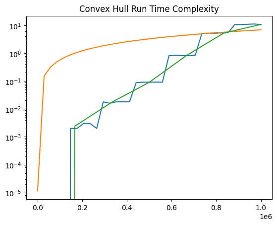
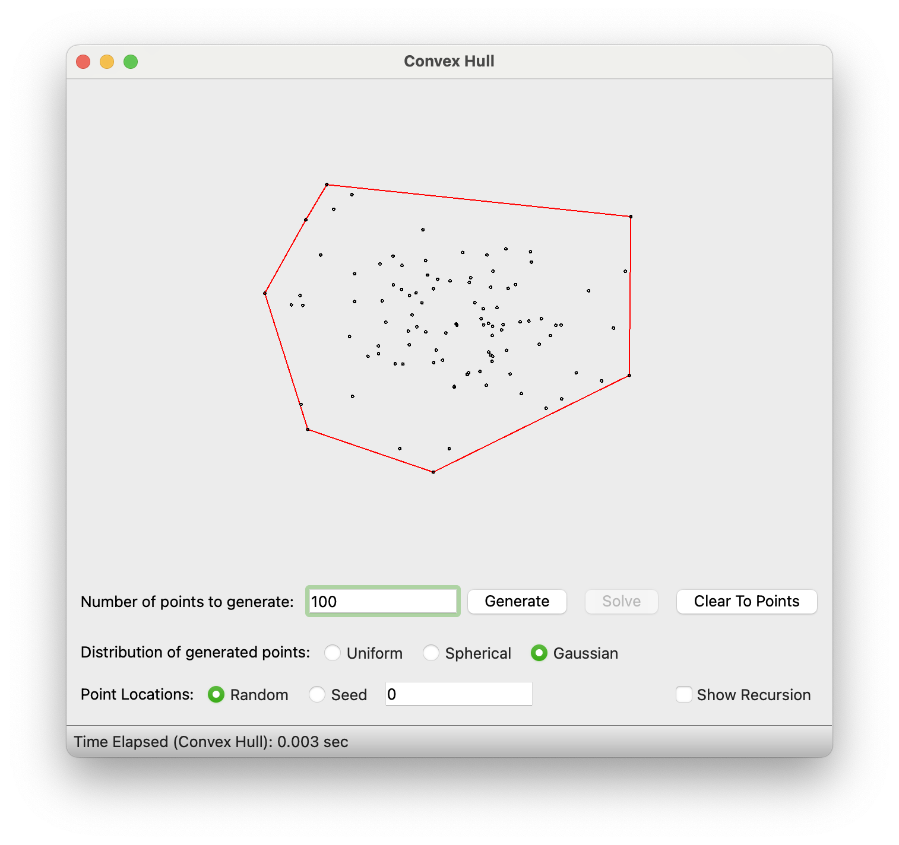
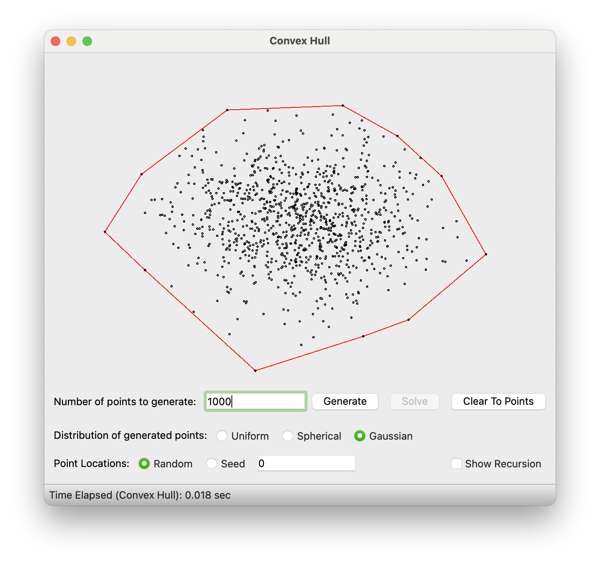

# Project 2 Writeup -- Parker Nilson
## 1. Source Code
See appendix.
## 2a. Runtime Complexity
The overall runtime complexity of this algorithm is NLog(N). I will show this by considering the various components of this algorithm and analyzing their individual runtime complexities and then combining those to arrive at an overall time complexity.

### 1. Sort points by x-coordinate
```python
points_by_x = sorted(points, key=lambda point: point.x())
```
Before we can perform the divide and conquer portion, we must sort the points into something that can be divided in half. We do this by using the built-in sort method in python which is an NLog(N) operation--making the best conceivable overall runtime NLog(N).

### 2. Split into halves recursively
```python
if len(points) < 4:
    extreme = self.find_extreme(points, side)
    points_sorted_cw = self.sorted_points_cw(extreme, points, side)
    reference_node = self.construct_hull_list(points_sorted_cw)
    pivot_node = self.find_hull_extreme(reference_node, Side.LEFT if side == Side.RIGHT else Side.RIGHT)
    return pivot_node

# split into two hulls
left_points = points[: len(points) // 2]
left_hull_pivot_node = self._compute_hull(left_points, Side.LEFT)
right_points = points[len(points) // 2 : len(points)]
right_hull_pivot_node = self._compute_hull(right_points, Side.RIGHT)
```
In this portion of the code, we split the points in half until we reach the base case where there are less than 4 points (meaning we can form a triangle in constant time). The triangle is a doubly linked list (each node pointing to the clockwise and counter-clockwise nodes of the hull). Since the max size at the base case is 3, this is a constant time operation at the leaves.

### 3. On the way up, merge the hulls in linear time
```python
# find the upper and lower tangents
upper_tangent = self.compute_tangent(
    left_hull_pivot_node, right_hull_pivot_node, Tangent.UPPER
)
lower_tangent = self.compute_tangent(
    left_hull_pivot_node, right_hull_pivot_node, Tangent.LOWER
)

# reform the hull
upper_tangent.n1.cw = upper_tangent.n2
upper_tangent.n2.ccw = upper_tangent.n1
lower_tangent.n1.ccw = lower_tangent.n2
lower_tangent.n2.cw = lower_tangent.n1
```
After finding the hulls of the two halves, the next step is to merge them together in linear time. This can be seen above (see appendix for direct implementation of `self.compute_tangent`). This merge operation works by finding the upper tangent which connects the two hulls and the lower tangent, then re-linking the linked list to connect the two hulls (the garbage collector will then delete all of the nodes which are no longer pointed to by the linked list).

Finding the tangents works as follows (I will discuss only the upper tangent as the lower tangent is exactly the same except with some aspects reversed, and doing a linear operation twice does not increase its order of magnitude):
1. Form an edge from the rightmost node of the left hull to the leftmost node of the right hull
2. Move the left node counterclockwise until doing so no longer decreases the slope of the edge
3. Move the right node clockwise until doing so no longer increases the slope of the edge
4. Repeat steps 2 and 3 until there is no change

During this operation we will touch each node in each hull no more than once (and in most cases we will do far less than that), therefore the runtime complexity of this is O(N).

### 4. Finding the leftmost and rightmost nodes for the merge
```python
new_pivot_node = self.find_hull_extreme(
    node_in_new_hull, Side.RIGHT if side == Side.LEFT else Side.LEFT
)
return new_pivot_node
```
In order to merge the hulls, the rightmost and leftmost nodes must be found for right and left hulls respectively. This is a simple linear operation where we check all the nodes and take the one with either the lowest or highest x-coordinate. Since the merge operation is also linear, this does not change the overall runtime complexity of the merge.

### Conclusion about runtime complexity
In conclusion, since we are performing an O(N) operation at each level of the recursion tree (which is to say log(N) times), we end up with an overall runtime of Nlog(N) + Nlog(N) (from the initial sort we did), which ends up being Nlog(N) in total. This can be confirmed with the masters theorem:
```
T(N) = 2 * T(N/2) + O(N)
```
Where `a = 2` because we are branching by 2, `b = 2` since we are halving the points at each branch, and `d = 1` since the work done at each node is `O(N)`. This means that `a/b^d = 2/2^1 = 1`, so the runtime of the algorithm is `O(N^d * log(N))` where `d = log2(2) = 1` so the runtime complexity is `O(Nlog(N))`.

## 2b. Space complexity
The space complexity of this algorithm is O(N). This is because the recursion essentially performs a depth-first search of the recursion tree, and since the size of the data is halved at each juncture, no more than a maximum of 2N will be on the call stack at any given point in time. Therefore the amount of memory used will always be within a constant factor of N.

## 3. Experimental Outcomes
### Data
| Sample Size | Runtimes | Mean |
|-------------|----------|------|
10 | 0, 0, 0, 0, 0 | 0
100 | 0.002, 0.002, 0.003, 0.003, 0.002 | 0.002
1000 | 0.018, 0.016, 0.018, 0.018, 0.018 | 0.018
10000 | 0.088, 0.091, 0.091, 0.092, 0.091 | 0.091
100000 | 0.816, 0.839, 0.819, 0.816, 0.848 | 0.828
500000 | 5.149, 5.239, 5.222, 5.373, 5.384 | 5.273
1000000 | 10.633, 10.631, 10.950, 11.164, 10.657 | 10.807



In the graph above, it can be seen that the empirical runtimes (Blue = emprical runtimes, Green = mean runtimes) of this algorithm match closely with the pattern seen in the Nlog(N) graphed in orange. While the emprical runtimes seem almost linear, it is still evident that they begin to taper at the end like the orange line. The estimated constant of proportionality in this case is 5e-07. This was found by graphing an Nlog(N) line with different coefficients until the lines were similar as can be seen in the following Jupyter Notebook:
```python
import numpy as np
import matplotlib.pyplot as plt

x = np.linspace(10, 1000000, 35)

a = [0, 0, 0, 0, 0]
b = [0.002, 0.002, 0.003, 0.003, 0.002]
c = [0.018, 0.016, 0.018, 0.018, 0.018]
d = [0.088, 0.091, 0.091, 0.092, 0.091]
e = [0.816, 0.839, 0.819, 0.816, 0.848]
f = [5.149, 5.239, 5.222, 5.373, 5.384]
g = [10.633, 10.631, 10.950, 11.164, 10.657]

empirical_runtimes = a + b + c + d + e + f + g
mean_runtimes = [np.mean(a), np.mean(b), np.mean(c), np.mean(d), np.mean(e), np.mean(f), np.mean(g)]

mean_xs = np.linspace(10, 1000000, 7)

c = 0.0000005
# c = 1
theoretical_runtimes = list(map(lambda v: np.log(v) * v * c, x))

fig, ax = plt.subplots()
ax.set_title('Convex Hull Run Time Complexity')
ax.set_yscale("log")
ax.plot(x, empirical_runtimes)
ax.plot(x, theoretical_runtimes)
ax.plot(mean_xs, mean_runtimes)
plt.show()
```

## 4. Observations on theoretical and empirical analyses
My theory for why the empirical data looks more linear is that we are performing a lot of O(N) calculations that have to do with graphing the points, and the algorithm runs extremely fast so some of the theoretical runtimes might be seen on a larger data. I believe that the linear aspects of this algorithm are likely far more costly than the logarithmic aspects so that is why in real application it looks more like a linear line.

## 5. Correct screenshots at 100 and 1000




## Appendix
```python
def slope_to(self, p1: QPointF, p2: QPointF) -> float:
    line = QLineF(p1, p2)
    return line.dy() / abs(line.dx()) if line.dx() != 0 else float("inf")

def node_slope_to(self, n1: HullNode, n2: HullNode) -> float:
    line = QLineF(n1.point, n2.point)
    return line.dy() / abs(line.dx()) if line.dx() != 0 else float("inf")

def sorted_points_cw(
    self, reference: QPointF, points: list[QPointF], reference_side: Side
):
    """
    Sorts the given points by slope to the reference point, in the given direction.
    If the direction is clockwise, the points will be sorted as follows:
    If direction is clockwise:
    [reference, ...sorted by increasing slope]
    If direction is counterclockwise:
    [reference, ...sorted by increasing slope]
    """
    without_reference = [point for point in points if point != reference]
    sorted_list = sorted(without_reference, key=lambda point: self.slope_to(reference, point), reverse=reference_side == Side.LEFT)
    return [reference] + sorted_list

def find_extreme(self, points: list[QPointF], side: Side):
    """
    If left, then returns the leftmost point. If not left (right) then returns the rightmost point.
    """
    extreme = points[0]
    for point in points[1:]:
        if side == Side.RIGHT and point.x() > extreme.x():
            extreme = point
        elif side == Side.LEFT and point.x() < extreme.x():
            extreme = point
    return extreme

def find_hull_extreme(self, hull_node: HullNode, side: Side):
    extreme = hull_node
    visited = set()
    cur_node = hull_node
    while cur_node not in visited:
        visited.add(cur_node)
        if side == Side.LEFT and cur_node.point.x() < extreme.point.x():
            extreme = cur_node
        if side == Side.RIGHT and cur_node.point.x() > extreme.point.x():
            extreme = cur_node

        if cur_node.cw == None:
            raise Exception("Hull is not a closed loop")
        
        cur_node = cur_node.cw
    return extreme

def construct_hull_list(self, points: list[QPointF]) -> HullNode:
    """
    Args:
        points - a list of points sorted in clockwise order, starting with either
        the leftmost or rightmost point
    """
    if len(points) == 1:
        return HullNode(points[0])

    first_node = HullNode(points[0])

    prev_node = first_node

    for point in points[1:]:
        cur_node = HullNode(point, ccw=prev_node)
        prev_node.cw = cur_node
        prev_node = cur_node

    prev_node.cw = first_node
    first_node.ccw = prev_node

    return first_node

def compute_tangent(
    self,
    left_hull_pivot_node: HullNode,
    right_hull_pivot_node: HullNode,
    tangent_side: Tangent,
) -> HullEdge:
    tangent_edge = HullEdge(left_hull_pivot_node, right_hull_pivot_node)

    invert = 1 if tangent_side == Tangent.UPPER else -1

    left_point_found = False
    right_point_found = False
    while not left_point_found or not right_point_found:
        while not left_point_found:
            next_node = (
                tangent_edge.n1.ccw if tangent_side == Tangent.UPPER else tangent_edge.n1.cw
            )
            if invert * self.node_slope_to(next_node, tangent_edge.n2) < invert * tangent_edge.slope:
                tangent_edge.set_n1(next_node)
            else:
                left_point_found = True

        next_right_node = (
            tangent_edge.n2.cw if tangent_side == Tangent.UPPER else tangent_edge.n2.ccw
        )
        if invert * self.node_slope_to(tangent_edge.n1, next_right_node) > invert * tangent_edge.slope:
            right_point_found = False

        while not right_point_found:
            next_node = (
                tangent_edge.n2.cw if tangent_side == Tangent.UPPER else tangent_edge.n2.ccw
            )
            if invert * self.node_slope_to(tangent_edge.n1, next_node) > invert * tangent_edge.slope:
                tangent_edge.set_n2(next_node)
            else:
                right_point_found = True

        next_left_node = (
            tangent_edge.n1.ccw if tangent_side == Tangent.UPPER else tangent_edge.n1.cw
        )
        if invert * self.node_slope_to(next_left_node, tangent_edge.n2) < invert * tangent_edge.slope:
            left_point_found = False

    return tangent_edge

def _compute_hull(self, points: list[QPointF], side: Side) -> HullNode:
    """
    Returns a node in a linked list which represents a convex hull.
    The node returned by this function is the furthest node on the opposite side of the hull that is
    being calculated (i.e. if this is a left hull, the rightmost node will be returned) so that
    the node can be used as the pivot node for the next hull.
    """
    if len(points) < 4:
        extreme = self.find_extreme(points, side)
        points_sorted_cw = self.sorted_points_cw(extreme, points, side)
        reference_node = self.construct_hull_list(points_sorted_cw)
        pivot_node = self.find_hull_extreme(reference_node, Side.LEFT if side == Side.RIGHT else Side.RIGHT)
        return pivot_node

    # split into two hulls
    left_points = points[: len(points) // 2]
    left_hull_pivot_node = self._compute_hull(left_points, Side.LEFT)
    right_points = points[len(points) // 2 : len(points)]
    right_hull_pivot_node = self._compute_hull(right_points, Side.RIGHT)

    # combine the two hulls:

    # find the upper and lower tangents
    upper_tangent = self.compute_tangent(
        left_hull_pivot_node, right_hull_pivot_node, Tangent.UPPER
    )
    lower_tangent = self.compute_tangent(
        left_hull_pivot_node, right_hull_pivot_node, Tangent.LOWER
    )

    # reform the hull
    upper_tangent.n1.cw = upper_tangent.n2
    upper_tangent.n2.ccw = upper_tangent.n1
    lower_tangent.n1.ccw = lower_tangent.n2
    lower_tangent.n2.cw = lower_tangent.n1

    # get a node that is guaranteed to be in the new hull
    node_in_new_hull = upper_tangent.n1

    new_pivot_node = self.find_hull_extreme(
        node_in_new_hull, Side.RIGHT if side == Side.LEFT else Side.LEFT
    )
    return new_pivot_node

# This is the method that gets called by the GUI and actually executes
# the finding of the hull
def compute_hull(self, points: list[QPointF], pause, view):
    self.pause = pause
    self.view = view
    assert type(points) == list and type(points[0]) == QPointF

    t1 = time.time()

    points_by_x = sorted(points, key=lambda point: point.x())

    t2 = time.time()

    t3 = time.time()

    left_node_of_hull = self._compute_hull(points_by_x, Side.LEFT)
    polygon = []
    visited = set()
    cur_node = left_node_of_hull
    while cur_node not in visited:
        visited.add(cur_node)
        polygon.append(QLineF(cur_node.point, cur_node.cw.point))
        cur_node = cur_node.cw

    t4 = time.time()

    # when passing lines to the display, pass a list of QLineF objects.  Each QLineF
    # object can be created with two QPointF objects corresponding to the endpoints
    self.showHull(polygon, RED)
    self.showText("Time Elapsed (Convex Hull): {:3.3f} sec".format(t4 - t3))
```